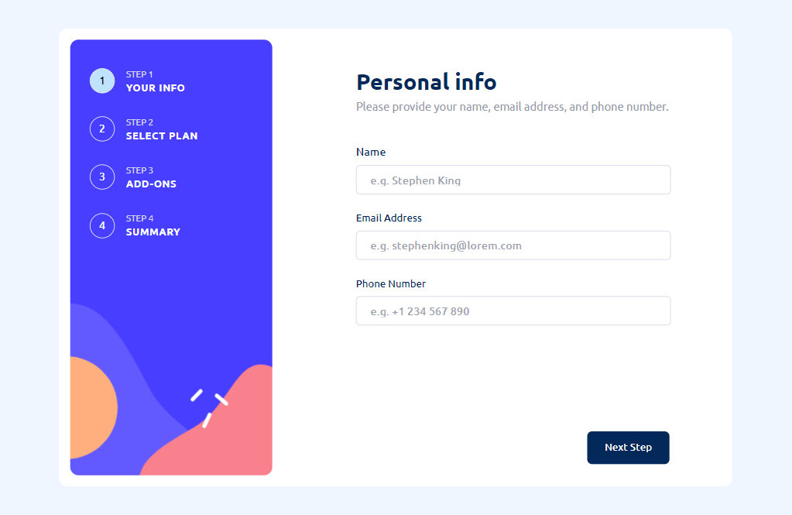
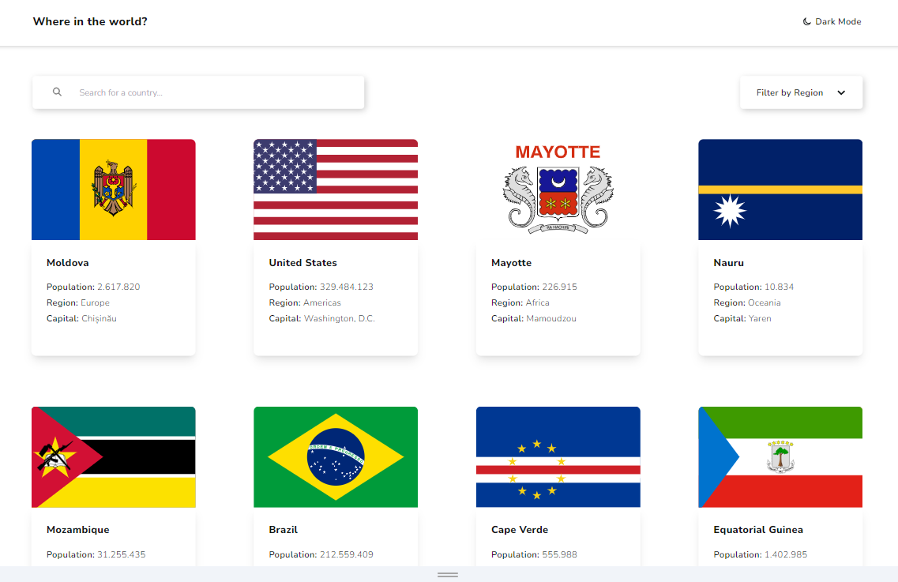
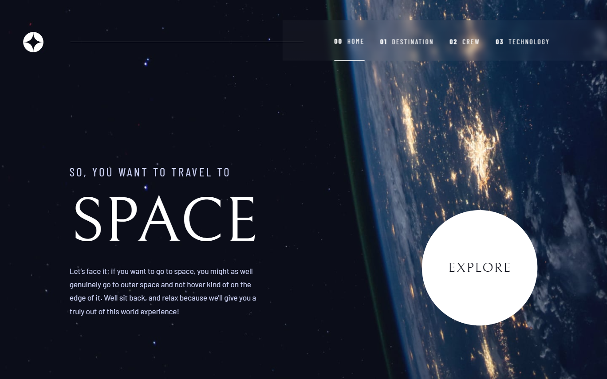
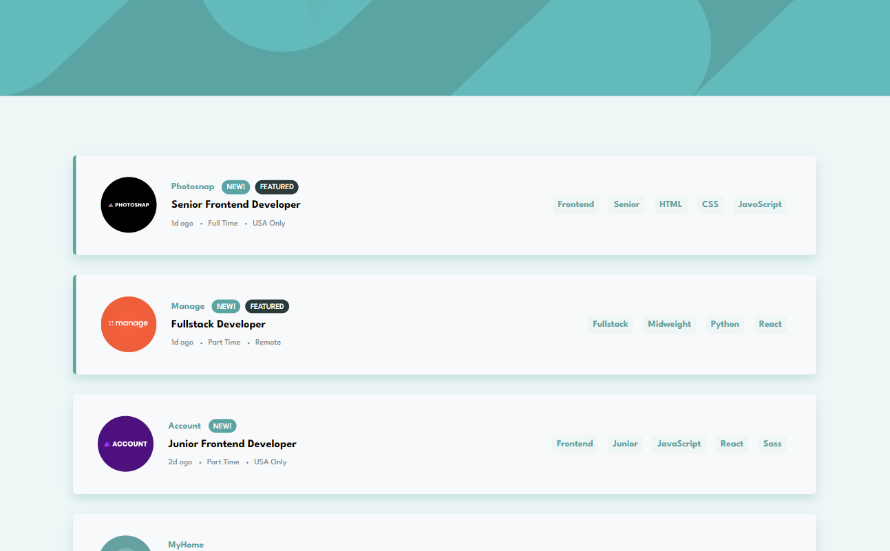
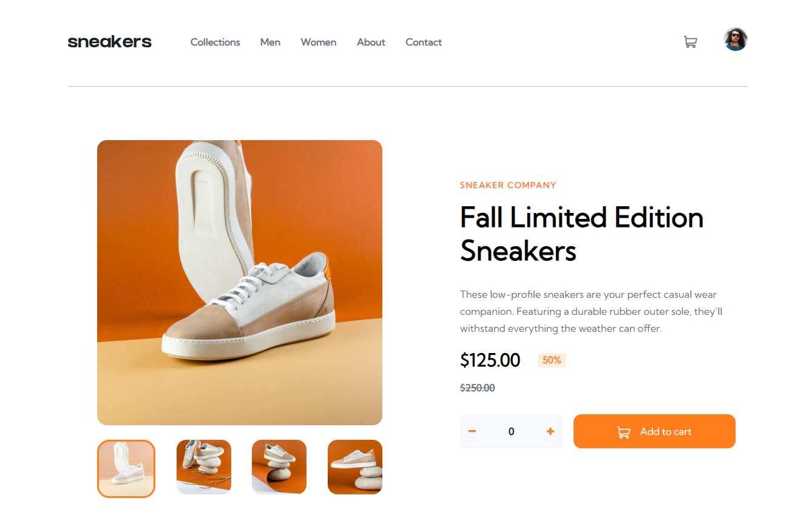

# Frontend Mentor Challenges

This is a list of all my completed challenges on frontend mentor, i've wanted to make a direct link by grouping all of them right here.

### Projects:

<table align="center"><tr><td>
  <h2 align="center">Multistep Form</h2>
  <picture>
    
  </picture>
     

  <h3 align="center">
    
  </h3>
 

  <a href="https://daninewacc.github.io/multistep-form/">Live</a> |
  <a href="https://github.com/DaniNewAcc/multistep-form">Repository</a>

</td></tr>
</table>

<table align="center"><tr><td>
  <h2 align="center">REST Countries</h2>
  <picture>
    
  </picture>
     

  <h3 align="center">

  </h3>
 

  <a href="https://daninewacc.github.io/rest-countries/">Live</a> |
  <a href="https://github.com/DaniNewAcc/rest-countries">Repository</a>

</td></tr>
</table>
<table align="center"><tr><td>
  <h2 align="center">Space Tourism</h2>
  <picture>
    
  </picture>
     

  <h3 align="center">

  </h3>
 

  <a href="https://daninewacc.github.io/space-tourism/">Live</a> |
  <a href="https://github.com/DaniNewAcc/space-tourism">Repository</a>

</td></tr>
</table>
<table align="center"><tr><td>
  <h2 align="center">Job Listing</h2>
  <picture>
    
  </picture>
     

  <h3 align="center">

  </h3>
 

  <a href="https://daninewacc.github.io/job-listing/">Live</a> |
  <a href="https://github.com/DaniNewAcc/job-listing">Repository</a>

</td></tr>
</table>
<table align="center"><tr><td>
  <h2 align="center">Ecommerce Product</h2>
  <picture>
    
  </picture>
     

  <h3 align="center">

  </h3>
 

  <a href="https://daninewacc.github.io/ecommerce-product-page/">Live</a> |
  <a href="https://github.com/DaniNewAcc/ecommerce-product-page">Repository</a>

</td></tr>
</table>
